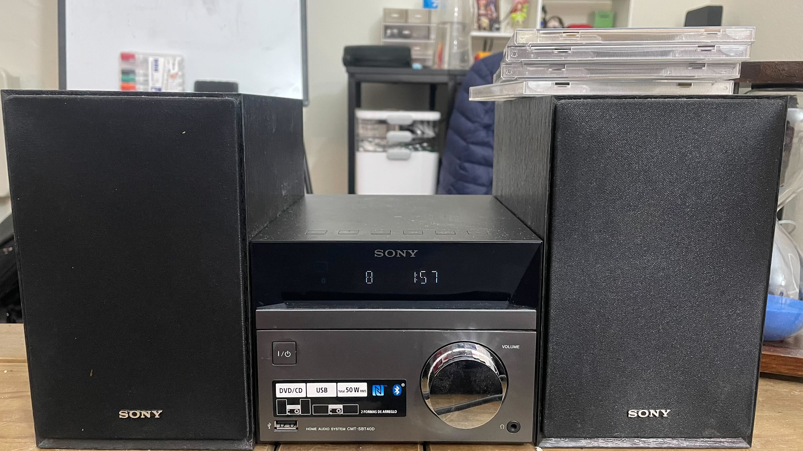

今天是2026年开工之后的第一个星期五。其实周中就多少想写点什么东西，可惜一直被工作占据一拖再拖。本来今晚还想再做点图，吃完晚饭之后想着把碟放起来当bgm。谁曾想音量旋钮坏了，卡在了一个声音略大的音量下不来了。我平时放音乐一般都在8-9的音量怕吵到邻居，这样一来多少有点担心。

这也不是这个索法音响第一次坏了。上次在疫情期间卡碟，被我大卸三块救回来了——毕竟是2016年开始从美国陪我一直到英格兰苏格兰的老友，多多少少还是有些感情。这次觉着，也许它也是要寿终正寝了。

虽然播放器可能不行了，但毕竟这对箱子还是短小精悍音效还好，于是乎想去Amazon上再找一个播放器跟它们重新凑一组——结果意外发现现在最便宜的蓝光机居然只要80镑，DVD机更是只要40镑。作为索尼审美病忠实患者，说不动心是不可能的。可话又说回来，我的底线是这对音响能接着用下去。搜罗了一圈发现因为是早期相对紧凑式的HiFi系统，所以音箱是用线直接接放大后模拟输出的。讲人话就是不太可能有其他当下能买到的播放器能在不加功放/转接的前提下直插。

我自己除了n年前买的《魍魉之匣》的蓝光和某妖精帝国专辑里附带的演唱会，平时确实也没有什么看蓝光碟的需要，当然是pass。随后又尝试了大卸八块想修一修旋钮，最后还是无疾而终。解决方式是买了个遥控器，看看能不能直接调吧。

忙活了一晚上最后还是用略微有点大的音量放起了《金平糖レトロチカ》。找碟的时候还意外发现了去年赶上企划重制买的还没拆封的stellatram的魔塔同人三部曲（其中两张之前高价收过中古品www），除了感慨了一下自己的记性确实大不如前放着它们吃灰似乎也不能再凭吊更多。

新学期开工之前自己写计划的时候信誓旦旦地在白板上写下一个每周“70hrs”的雄心壮志。遥想自己最努力的时候居然是本科的9-11-6，也算是天天忆苦思甜了。相比没有洗澡自由的当年，如今每周可以去踢球两次随时回家的生活又有什么理由不珍惜呢？

雄心壮志完成几何姑且不说，至少精神状态还不错。尤其是考虑到苏格兰这个神天气可能真要让我感受一下人生第一次的霪雨霏霏连“月”不开了，当下的轻松感真是可喜可贺可喜可贺！去年通过规律健身有意识地训练Se的成效保留的基础上，今年的重点可能就是保持开放态度的Ne，有条不紊地做事情。长期有自己认为有意义的事情做其实是一种很幸福的状态。

昨天谷歌学术提醒我自己24年发的文章引用过10了，i10 index+1。一看引用人，是个捷克做土壤生物学的课题组。挺开心！我就喜欢跟我领域没关系的人来引用我——至少说明这文章不是仅仅的小领域黑话自黑，多少还有些对不同方向的价值...

国足进了U23亚洲杯决赛，阿森纳要贷款六冠王，我有paper和proposal可写，我们都有光明的前途！